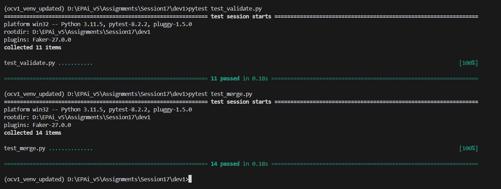
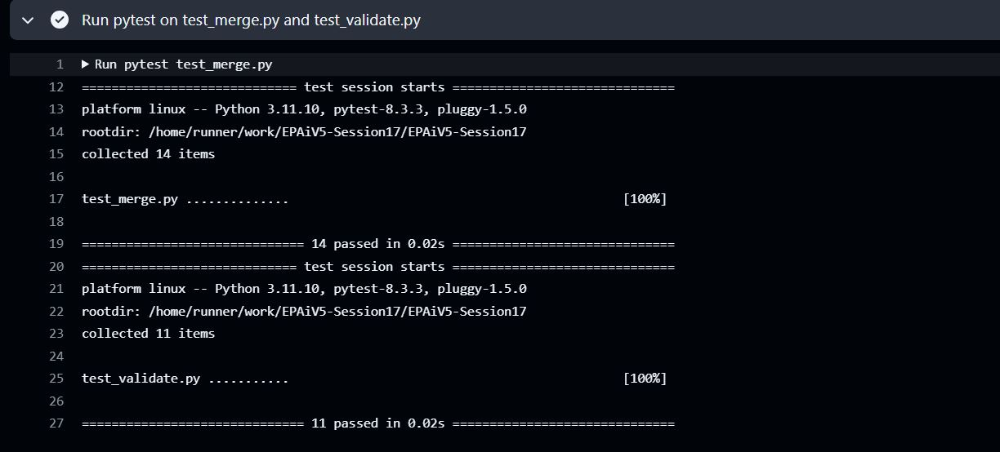

# EPAiV5-Session17 - Validate & Merge Word Frequency Dictionaries


This assignmnet work includes two key Python modules: `student_code.py` and `student_merge.py`. These modules provide utility functions to validate dictionary structures and merge word frequency dictionaries, respectively. Each module addresses specific requirements related to data integrity, recursive handling of nested structures, and merging strategies with performance optimizations. Additionally, `student_merge.py` includes a **sorting feature as a bonus**.

## student_code.py
This module contains a `validate` function that ensures a given dictionary (`data`) matches a specified structure (`template`). The `validate` function verifies the presence of required keys, the correct data types, and the integrity of nested structures, making it especially useful for scenarios requiring strict schema validation.

### Overview of `validate` Function
The `validate` function recursively checks whether `data` conforms to the `template`. It inspects each key and verifies that:

1. All required keys in the `template` are present in `data`.
2. All keys in `data` exist in `template` (no extra keys are allowed).
3. The data types of values in `data` match the expected types in `template`.
4. Nested dictionaries are validated recursively, allowing for deep, multi-level structures.

#### Parameters:

- `data` (dict): The dictionary to be validated.
- `template`(dict): The template dictionary defining the expected structure and data types.
- `path` (str, optional): The path of the current key, used for constructing detailed error messages.

**Returns:**

A tuple `(state, error)`, where `state` is a boolean indicating validation success, and error is an empty string if validation passed or a descriptive error message if it failed.

#### Key Features and Requirements Met
##### 1. Value Types
- **Single Values and Nested Dictionaries:** The function supports both single-value types (e.g., strings, integers) and nested dictionaries, allowing recursive checks for deep structures.
##### 2. Exclusion of Lists
- **No Lists:** Lists are not supported as values in this validation function, aligning with the requirement that lists should not be included as valid data types.
##### 3. Mandatory Keys and No Extra Keys
- **Required Keys:** The function ensures that all keys defined in `template` are present in `data`, and reports an error if any are missing.
- **No Extra Keys:** If `data` contains keys not present in `template`, the function returns an error with the path of the extra key, enforcing strict compliance.
##### 4. Structure and Type Validation Only
- **Type Validation:** The function uses `isinstance()` to verify that each value in data matches the type specified in `template`, focusing only on structural integrity, not specific values.
- **Structural Validation:** The function ensures that `data` adheres to the hierarchical key structure defined in `template`.
##### 5. Error Handling and Early Termination
- **Early Termination:** Validation stops at the first encountered error, making it efficient and ensuring immediate feedback on the nature of the discrepancy.
- **Clear Error Messages:** Each error message includes the path to the location of the error, helping users identify exactly where the issue lies within the nested structure.

#### Example Usage of validate


```
template = {
    "name": str,
    "age": int,
    "address": {
        "street": str,
        "city": str
    }
}

data = {
    "name": "John Doe",
    "age": 30,
    "address": {
        "street": "123 Maple Street",
        "city": "Springfield"
    }
}

is_valid, error_message = validate(data, template)
if is_valid:
    print("Data is valid.")
else:
    print(f"Validation error: {error_message}")

```

## student_merge.py
The `student_merge.py` module provides functions to merge multiple word frequency dictionaries, combining the counts of identical words. This is especially useful for tasks such as text analysis, where word counts from various sources need to be consolidated.

### Overview of Merging Functions
The module includes two functions:

- **merge_with_defaultdict:** Uses Python’s `defaultdict` for efficient accumulation of word frequencies.
- **merge_with_counter:** Utilizes Python’s `Counter` from the `collections` module to directly sum frequencies, offering a concise and optimized approach.
Both functions include a sorting option that orders the merged dictionary by word frequency in descending order, which is implemented to meet bonus requirements.

### Key Requirements Addressed
#### 1. Handling Arbitrary Numbers of Dictionaries
- **Variable Arguments:** Both functions accept a variable number of dictionary arguments (`*dicts`). This flexibility enables the user to merge any number of word frequency dictionaries.
#### 2. Edge Case Handling
- **Empty Inputs:** If no dictionaries are provided, the functions return an empty dictionary without errors.
- **Negative Counts:** The functions assume that frequencies are non-negative integers, as per typical use cases. If negative values are provided, they are included in the count sum, but negative word frequencies may indicate an error in the input data.
#### 3. No Side Effects
- **Immutable Original Dictionaries:** Both functions create new dictionaries and do not modify the original dictionaries, preserving input data integrity.

### Detailed Function Descriptions
#### `merge_with_defaultdict`
This function uses `defaultdict(int)` to merge multiple word frequency dictionaries. It initializes each word’s frequency to zero and adds frequencies from each input dictionary.

##### Parameters:

- `*dicts`: An arbitrary number of dictionaries, each containing words (keys) and frequencies (values).

**Returns:**

- A dictionary with all words from the input dictionaries, their combined frequencies, and optionally sorted by frequency in descending order.

```
from collections import defaultdict

def merge_with_defaultdict(*dicts):
    merged = defaultdict(int)
    for d in dicts:
        for word, freq in d.items():
            merged[word] += freq
    sorted_merged = dict(sorted(merged.items(), key=lambda x: x[1], reverse=True))
    return sorted_merged

```

#### `merge_with_counter`
This function leverages the `Counter` class, which allows for direct summing of dictionaries. The `update` method of `Counter` automatically adds frequencies from multiple dictionaries.

##### Parameters:

- `*dicts`: An arbitrary number of dictionaries, each containing words (keys) and frequencies (values).

**Returns:**

- A dictionary with all words from the input dictionaries, their combined frequencies, and optionally sorted by frequency in descending order.


```
from collections import Counter

def merge_with_counter(*dicts):
    merged = Counter()
    for d in dicts:
        merged.update(d)
    sorted_merged = dict(merged.most_common())
    return sorted_merged

```

#### Sorting Feature for Bonus Points
Both functions include a **sorting feature as a bonus requirement**. After merging, the resulting dictionary is sorted by word frequency in descending order. This feature is helpful for use cases where the most common words need to be prioritized or quickly accessible.

##### Example Usage of `merge_with_defaultdict` and `merge_with_counter`


```
dict1 = {"apple": 2, "banana": 3}
dict2 = {"apple": 1, "cherry": 5}
dict3 = {"banana": 1, "cherry": 2}

# Using merge_with_defaultdict
merged_defaultdict = merge_with_defaultdict(dict1, dict2, dict3)
print("Merged with defaultdict:", merged_defaultdict)

# Using merge_with_counter
merged_counter = merge_with_counter(dict1, dict2, dict3)
print("Merged with Counter:", merged_counter)

```


## Test Results

### Local PC Execution




### Workflow Actions




## Summary
Together, the `student_code.py` and `student_merge.py` modules offer comprehensive validation and merging capabilities, handling various edge cases and requirements with efficiency and clarity. The `validate` function ensures dictionary structure integrity, while the merging functions consolidate word frequencies with an optional sorting feature for further usability. This combination of utilities is suitable for applications that require robust data validation and analysis.


---------------------------------------------------------------------------------------------------------------------------------------------------

**Submission by** - Hema Aparna M

**mail id** - mhema.aprai@gmail.com

---------------------------------------------------------------------------------------------------------------------------------------------------

